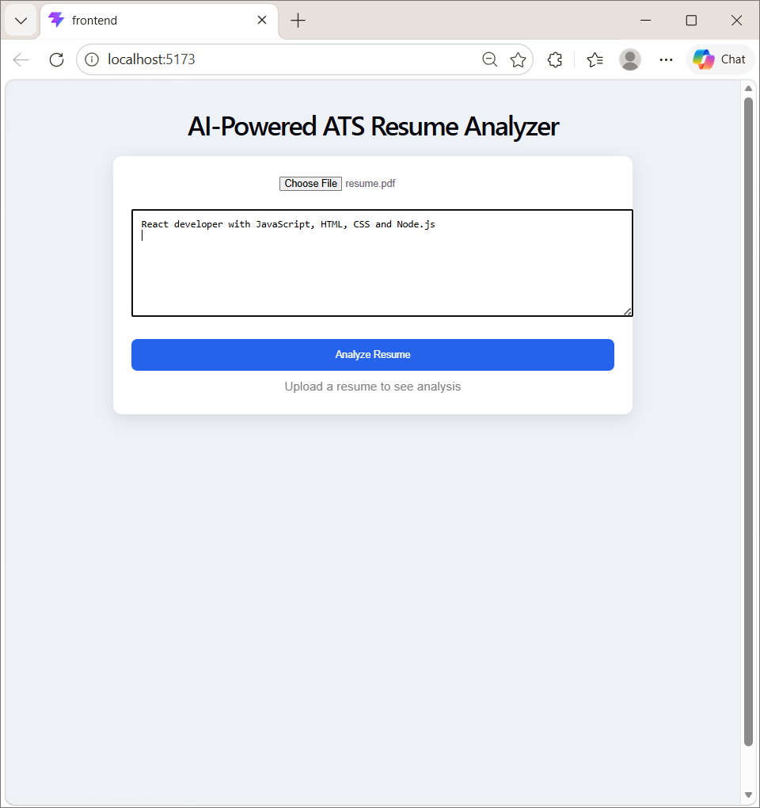
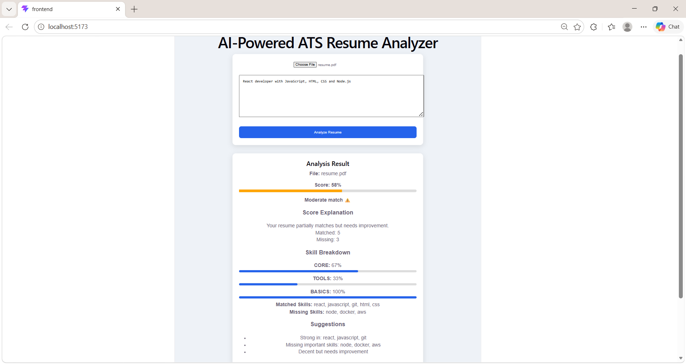

# AI-Powered ATS Resume Analyzer

Analyze resumes against job descriptions using weighted skill matching and get actionable feedback on skill gaps.

---

## 🚀 Features

* Upload resume (PDF)
* Paste job description
* Get ATS score (0–100%)
* Skill matching (core, tools, basics)
* Missing skills detection
* Smart suggestions
* Score breakdown by category
* Visual progress bars

---

## 🧠 How it Works

1. Extract text from resume using pdf-parse
2. Normalize skills using synonym mapping
3. Match skills against predefined categories:

   * Core Skills (React, Node, JS)
   * Tools (AWS, Docker, Git)
   * Basics (HTML, CSS)
4. Apply weighted scoring:

   * Core → High weight
   * Tools → Medium
   * Basics → Low
5. Generate:

   * Final score
   * Skill breakdown
   * Suggestions

---

## 📊 Example Output

* Score: 65%
* Matched Skills: React, JavaScript, HTML
* Missing Skills: Node, AWS, Docker

---

## 🛠️ Tech Stack

* Frontend: React (Vite)
* Backend: Node.js + Express
* File Upload: Multer
* PDF Parsing: pdf-parse

---

## 📸 Screenshots

### Input Screen



### Result Screen



---

## ⚙️ Installation

```bash
git clone https://github.com/abhinaya06-tech/ATS-Analyzer.git
cd ATS-Analyzer
```

### Backend

```bash
cd backend
npm install
node server.js
```

### Frontend

```bash
cd frontend
npm install
npm run dev
```
